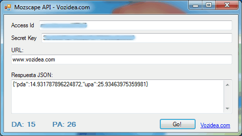

Mozscape-API-DA-PA-CSharp
=========================

Ejemplo de uso de la API Mozscape con C#. El ejemplo obtiene los valores de Page Authority y Domain Authority de una URL, en el siguiente artículo explico [que es Domain Authority y Page Authority](http://www.vozidea.com/que-es-domain-authority-y-page-authority).

Requisitos del programa
=======================
Para usar el código son necesarios los datos de autenticación de la API de MOZ “Access ID” y “Secret Key”.

Se trata de un código bajo .Net Framework 4.0 programado en C# con Visual Studio 2010.

Notas
=====
En artículo [Cómo usar Mozscape API de MOZ con C#](http://www.vozidea.com/como-usar-mozscape-api-de-moz-con-c) se explican detalladamente todas las partes de la petición HTTP a la API Mozscape.

También se describe el proceso para firmar la petición y asi autentificarnos correctamente.

Recordar también que la versión gratuita la API de MOZ tiene ciertas limitaciones de las que se informa en la [documentación oficial de la API](http://moz.com/products/api).
